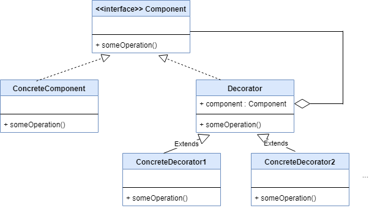

# Decorator Patter
## What is this pattern?
> Decorator Pattern is a design pattern that `allows behavior to be added to an individual object, dynamically, without affecting the behavior of other objects` from the same class.
>
> The Decorator Pattern is often useful for adhering to the Single Responsibility Principle, as it allows functionality to be `divided between classes` with unique areas of concern.
>
> Decorator use can be more efficient than subclassing, because an object's behavior can be `augmented without defining an entirely new object`.

## When to use this pattern?
Use this pattern when you are designing an application that features an indefinite number of related-instances that stack to each other.

## UML Diagram

## When NOT to use this pattern?
When your application is `straight-forward`, and `do NOT maintain indefinite number of related-instances`.

## Benefits of using this pattern
1. It eliminates the maintaining of list of related-instances to keep track of them
1. Clean code; prevents the codebase from getting convoluted
1. Simple and small in design
1. It minimized the number of complex logics and variables
1. Prevents unwelcome instance/data mutation
1. Read more [here](https://www.javatpoint.com/decorator-pattern)

## Existing internal projects that uses this pattern
1.

## References
1. [Wikipedia](https://en.wikipedia.org/wiki/Decorator_pattern)
1. [Decorator Pattern UML](https://www.programmergirl.com/decorator-design-pattern-java/)
1. [Advantages of using Decorator Pattern](https://www.javatpoint.com/decorator-pattern)
