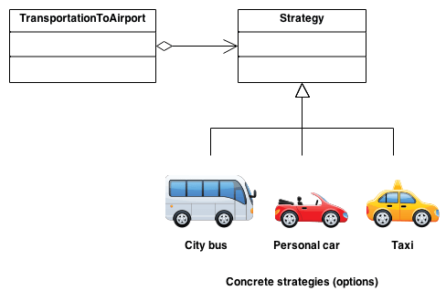

# Strategy Pattern
## What is this pattern?
> Strategy Pattern is a behavioral software design pattern that enables `selecting an algorithm at runtime`. Instead of implementing a single algorithm directly, code receives run-time instructions as to which in a `family of algorithms` to use.

## When to use this pattern?
Use this pattern when your application is huge and require uncomplicated and maintainable architecture, growing its size overtime, and *(as indicated)*:
1. Require dynamic selection of algorithm at runtime
1. Uses different strategies or algorithm

## UML Diagram

## When NOT to use this pattern?
When your application is `straight-forward`, and `do NOT require dynamic algorithm`.

## Benefits of using this pattern
1. This pattern enables uniforming of code regardless of number of developers involved at the same time
1. Clean code; codes are easy to review as each strategy pertains to specific purpose
1. It is easy to implement newer version of a certain strategy or algorithm
1. It prevents unnecessary exposure of instances/objects that doesn't concern certain areas that may lead to unwelcome mutations
1. Read more [here](https://betterprogramming.pub/design-patterns-using-the-strategy-pattern-in-javascript-3c12af58fd8a).

## Existing internal projects that uses this pattern
1. AlgoDx Platform
1. Detail Spiderman
1. Detail RnD
1. Detail CMS Re-arch

## References
1. [Wikipedia](https://en.wikipedia.org/wiki/Strategy_pattern)
1. [Advantages of using Strategy Pattern](https://betterprogramming.pub/design-patterns-using-the-strategy-pattern-in-javascript-3c12af58fd8a)
1. [UML Diagram](https://sourcemaking.com/design_patterns/strategy)
